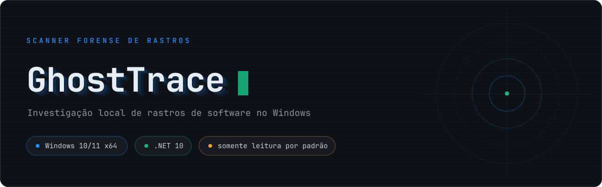
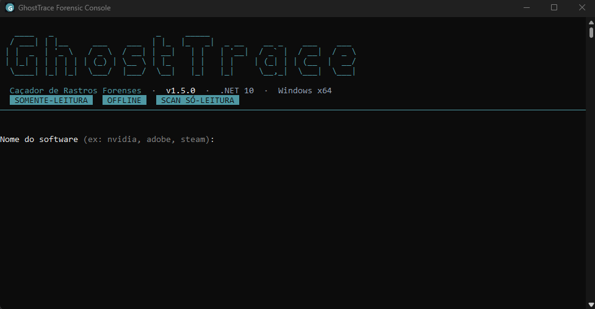
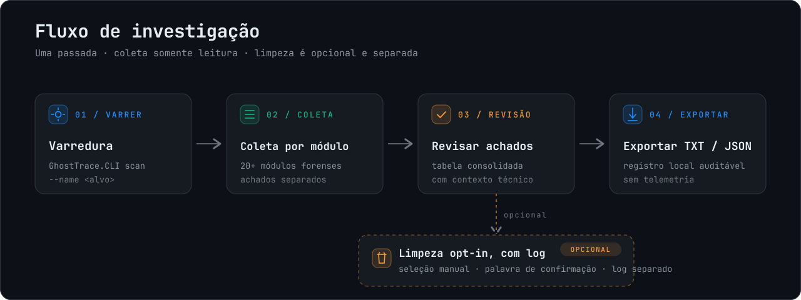
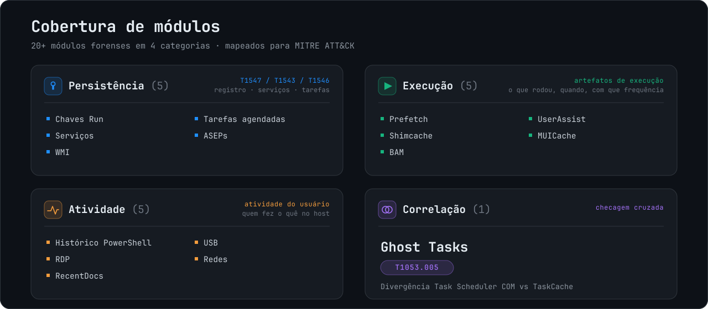

# GhostTrace



> **Find what software left behind on Windows, before it finds its way back.**

GhostTrace is a local Windows forensic trace hunter for incident responders, system administrators, and security-minded power users. It maps persistence, execution, activity, and leftover artifacts into a reviewable record, then offers tightly constrained cleanup only when you explicitly choose it.

[](https://github.com/Devzinh/GhostTrace/actions/workflows/ci.yml)
[](https://github.com/Devzinh/GhostTrace/releases/latest)


[](LICENSE)

**[Download](https://github.com/Devzinh/GhostTrace/releases/latest)** | **[Quick start](#quick-start)** | **[Capabilities](#what-it-collects)** | **[Safety model](#forensic-safety)** | **[Roadmap](docs/roadmap.md)** | **[Portuguese (Brazil)](docs/README_PT_BR.md)**

---

## Why GhostTrace

Uninstalling an application does not always remove its operational footprint. Startup entries, scheduled tasks, cached execution evidence, registry values, services, and folders can remain long after the installer reports success.

GhostTrace turns that broad question into a focused, local investigation:

- **One focused hunt** across 22 forensic modules.
- **Evidence by source**, with findings, errors, and metadata kept per module.
- **Offline by design**, with no telemetry, uploads, or cloud dependency.
- **Audit-ready output**, including TXT records, JSON outputs for directed collectors, and cleanup logs.
- **Human-controlled cleanup**, never automatic remediation.



## Quick start

### Install

Download the latest x64 MSI from [Releases](https://github.com/Devzinh/GhostTrace/releases/latest):

```text
GhostTrace-<version>-x64.msi
```

The package is self-contained, so the target machine does not need a pre-installed .NET runtime. Run GhostTrace as Administrator to access protected Windows artifacts.

### Hunt a software name

```powershell
GhostTrace.CLI scan --name nvidia
```

The interactive flow shows progress, groups findings by technique, and can export a record of the investigation. If safe cleanup candidates exist, you must select them and type a confirmation phrase before any removal occurs.

### Run it in automation

```powershell
GhostTrace.CLI scan --name nvidia --quiet --output C:\Cases\Host1
```

`--quiet` creates a non-interactive TXT record. A report write failure returns a non-zero exit code, so automation does not silently succeed without an artifact.

### Essential commands

| Goal | Command |
| --- | --- |
| Open the interactive menu | `GhostTrace.CLI` |
| Run a full triage | `GhostTrace.CLI scan` |
| Hunt a named application | `GhostTrace.CLI scan --name <name>` |
| Write a script-friendly scan record | `GhostTrace.CLI scan --name <name> --quiet --output <directory>` |
| Correlate Task Scheduler COM and TaskCache | `GhostTrace.CLI scan-tasks-correlate-json --output <report.json>` |
| Inspect a directory, Registry key, or Event Log | `scan-fs-json`, `scan-reg-json`, `scan-evt-json` |

Choose the interface language with `--lang`:

```powershell
GhostTrace.CLI scan --name nvidia --lang en
GhostTrace.CLI --lang pt-BR
```

## From collection to review



1. GhostTrace runs the modules available for the selected collection.
2. Each module returns its own findings, errors, and metadata.
3. The CLI renders a concise summary and writes a local record when requested.
4. Any selected cleanup operation is written to a separate audit log.

## What it collects



| Area | Evidence sources |
| --- | --- |
| Persistence | Run/RunOnce, Startup, services, Winlogon, IFEO, AppInit, LSA, Active Setup, WMI, and scheduled tasks |
| Execution | Prefetch, Shimcache, BAM/DAM, UserAssist, and MUICache |
| User activity | PowerShell history, outbound RDP history, RecentDocs, USB, and network artifacts |
| Installed software and leftovers | Uninstall entries, StartupApproved, Program Files, ProgramData, and AppData traces |
| Scheduled task correlation | COM and TaskCache discrepancies used to investigate Ghost Tasks (T1053.005) |

### Persistence modules

| Module | Source |
| --- | --- |
| `PersistenceScanModule` | Run/RunOnce and Startup folders |
| `ServicesScanModule` | Service and driver `ImagePath` values |
| `AsepScanModule` | Winlogon, IFEO, AppInit, LSA, and Active Setup |
| `ScheduledTasksScanModule` | Task Scheduler COM, including hidden tasks |
| `TaskCacheScanModule` | `TaskCache\Tree` anomalies |
| `WmiPersistenceScanModule` | `__EventFilter`, `__EventConsumer`, and bindings |

### Execution and activity modules

| Module | Source |
| --- | --- |
| `PrefetchScanModule` | Windows 10/11 `.pf` files, including XPRESS-Huffman compression |
| `ShimcacheScanModule` | AppCompatCache |
| `BamScanModule` | BAM/DAM records by SID |
| `UserAssistScanModule` | GUI launches and usage counts |
| `MuiCacheScanModule` | Shell MUICache |
| `PowerShellHistoryScanModule` | PSReadLine history and suspicious command signals |
| `RdpConnectionScanModule` | Outbound RDP connection history |
| `RecentDocsScanModule` | Explorer RecentDocs |
| `UsbDeviceScanModule` | USBSTOR history |
| `NetworkArtifactsScanModule` | Hosts file and known network profiles |

## Forensic safety

GhostTrace is a **read-only collector by default**. Its cleanup workflow targets software leftovers, not automatic malware remediation.

- No network calls, telemetry, evidence upload, or cloud account is required.
- Cleanup starts with no preselected item and requires explicit selection plus typed confirmation.
- Execution caches and activity histories are never cleanup candidates.
- A directory is removable only when it is directly under a trusted root, exactly matches the target name, and is not a junction or symlink.
- Partial name matches become `FilesystemTraceHint`: reportable, never removable.
- JSON reports are written atomically, preserving an existing report until a replacement completes.
- `Ctrl+C` cooperatively cancels scheduled-task correlation and Prefetch file reading.

> A finding is evidence, not a verdict. Interpret it with the host timeline, your environment, and your incident-response process.

## Outputs that fit the investigation

| Output | Best for |
| --- | --- |
| Interactive table | Fast analyst review |
| TXT report | Local record from `scan`, including `--quiet` automation |
| JSON report | Directed collectors and scheduled-task correlation |
| Cleanup log | Auditing removed, skipped, and failed cleanup actions |

`PartialSuccess` means a module produced findings but also encountered a limitation. Read that module's errors before treating an absent result as a clean source.

## Built to be trusted

- Pull requests restore, build, and test on Windows with .NET 10.
- The release gate tests the full `GhostTrace.sln` before building the MSI.
- Both `src/GhostTrace.Tests` and `tests/GhostTrace.Tests.Unit` are included in the solution and CI.
- Stable releases accept only `v<major>.<minor>.<patch>` tags.
- GhostTrace is released under the [MIT License](LICENSE).

## Star history

[](https://github.com/Devzinh/GhostTrace/stargazers)
[](https://www.star-history.com/?type=date&repos=Devzinh%2FGhostTrace)

Track the project's public star history on [Star History](https://www.star-history.com/?type=date&repos=Devzinh%2FGhostTrace).

## Documentation

- [Scheduled Tasks Correlation Playbook](docs/playbooks/scheduled-tasks-correlation.md)
- [Product roadmap](docs/roadmap.md)
- [UX and architecture decisions](docs/design/ux-architecture-decisions.md)
- [Test project guide](tests/README.md)
- [README in Portuguese (Brazil)](docs/README_PT_BR.md)

## Contributing

Contributions are welcome. Keep collectors read-only, propagate `CancellationToken`, surface coverage gaps as result errors, and include tests with behavior changes. The [roadmap](docs/roadmap.md) highlights the next high-impact areas.

---

GhostTrace supports investigation. Validate every artifact in the context of the host, its timeline, and your operating procedures.
